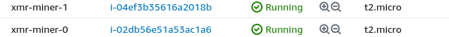

# AWS MONERO MINING

`Terraform` script to start one or more *EC2* monero-mining (`XMRIG`) instances. ⛏️ 🪙 ☁️
<br/>
<div style="width: 65%; height: 65%">

  
  
</div>  
<br/> 

## Disclaimer
This repo is intended only as a terraform learning exercise applied to the aws cloud platform.
<br/>
<br/>
- The author does not want to incentivize or promote monero mining.
- The author does not promise any financial gain from mining monero on the contrary, at present time he does not recommend using it for economic purposes as the price charged by the provider for the use of the resources could be higher than the mining gain.
<br/>

**The author also assumes no responsibility for any weaponization of this repository in order to exploit other people's aws accounts for monero mining.**

## Prerequisites 
- <a href="https://aws.amazon.com/console/">aws</a> account
- <a href="https://www.terraform.io/">Terraform</a> installed on the dev machine
<br/>
<br/>

Note: This script has been tested on `Ubuntu 22.04 LTS`

## Instructions
clone this repo and start terraform provisioning:
<br/>
```console
git clone https://github.com/R3DRUN3/aws-monero-mining.git \
&& cd aws-monero-mining
```
<br/>

Open the `./xmrig/run-xmrig.sh` file and modify it by inserting your monero wallet and the desired mining pool, 
<br/>
alternatively you can create a new json configuration <a href="https://xmrig.com/wizard">here</a>.
<br/>

You can also modify the `vars.tf` file to change some variables according to your needs,
<br/>

for example yuo can change the ec2 instance type (the default is a very *resources-constrained* machine), the number of instances etc.
<br/>

Launch the Terraform provisioning:
<br/>
```console
terraform init && terraform apply -auto-approve
```
<br/>
The whole procedure takes a few minutes.
In the end you can see the generated ec2 instances from your aws console:
<br/>
<div style="width: 65%; height: 65%">

  
  
</div>
<br/>

or via `aws-cli` with the following command:  
```console
aws ec2 describe-instances
```

If you open one of the instances and inspect resources'usage with the `htop` command,  
you can see that `xmrig` is running and mining new monero!
<br/>
<div style="width: 65%; height: 65%">

  
  
</div>  
<br/> 

Based upon the mining pool that you put in your configuration, you should be able to
see your current hashrate from the pool website:
<br/>
<div style="width: 65%; height: 65%">

  
  
</div>  
<br/> 